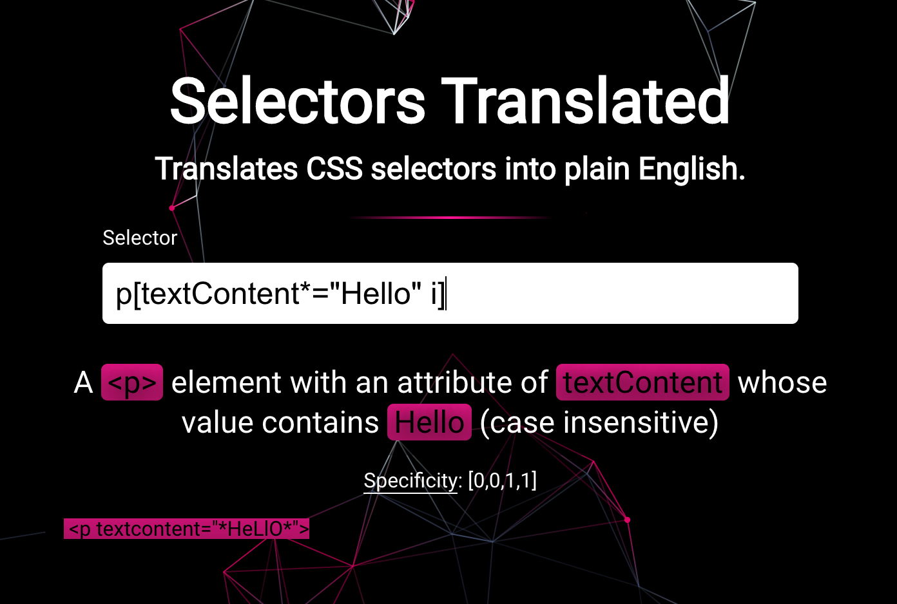

# Selectors Translated



## About

This project wants to help new web developers to learn how to use CSS selectors.

## Table of Contents

- [Features](#features)
- [Audience](#audience)
- [Using the project](#using-the-project)
- [Reference Links](#reference-links)
- [Contributing](#contributing)
- [Authors](#authors)

## Features

- Translate any CSS selector to plain english
- Visualize the element selection of a selector with conscious example
  Short sentences listing what are the key features of your tool

## Audience

Audience
This project is aimed at anyone who doesn't remember all the tweaks and tricks of CSS selectors and wants to use them (everyone)

## Using the project

- Write your desired selector within the selector input container

## Reference Links

- [MDN - CSS Selectors](https://developer.mozilla.org/en-US/docs/Web/CSS/CSS_Selectors)
- [W3schools - CSS Selectors Reference](https://www.w3schools.com/cssref/css_selectors.asp)

## Contributing

PRs welcome 🎉

Download project and install dependencies:

```bash
# clone the repository
git clone https://github.com/YardenPorat/selector-translator.git
# move to project's directory
cd selector-translator
# install dependencies
npm i
```

Start developing:

```bash
# Checkout to a new git branch
git checkout -b MY_BRANCH_NAME
# Start the dev server
npm start
# write your code
```

Running tests:

Run unit tests in node:

```bash
npm run test
```

Run browser specific tests in the browser with mocha and playwright:

```bash
npm run test:browser
```

Run all test and validation (test in node, test in browser, linting, typecheck)

```bash
npm run test:all
```

## Authors

- Yarden Porat - [LinkedIn](https://www.linkedin.com/in/yarden-porat/)
